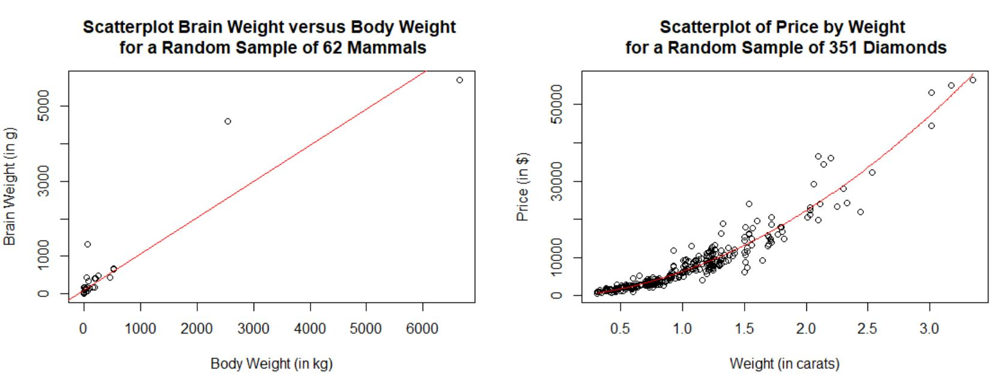
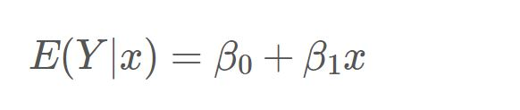
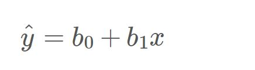
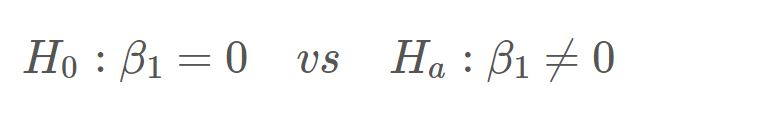

```{r setup, include = FALSE}
knitr::opts_chunk$set(echo = TRUE)
```

### Learning Objectives
1. Visualize the relationship of two quantitative variables
2. Quantify the strength of the relationship
3. Estimate the coefficients for a simple linear regression model
4. Visualize the estimated least squares regression line
5. Strengthen understanding of hypothesis tests for the population slope
6. Examine diagnostic plots for linear regression


***


## Statistical Review

### Exploring Linear Regression

We wish to study the relationship between two quantitative variables. Generally, one variable is the response variable (denoted by y) and the other variable is the explanatory variable (denoted by x). The response variable measures the outcome of the study and is also called the dependent variable. The explanatory variable is thought to explain the changes we see in the response variable and is also called the independent variable or the predictor variable. 

In this lab, we will examine relationships between two quantitative variables using a graphical tool called a scatterplot. We will interpret these scatterplots in terms of form, direction, and strength of the relationship, and use it to assess the appropriateness of using a linear regression model to describe the relationship between the two variables. If appropriate, we can perform a linear regression analysis to produce an estimated model that can be used to predict the value of the response for a given value of the predictor.  


***

## Coding Examples

### Data Sets and Packages

We will be utilizing two data sets throughout the lab tutorial. The first is our handy-dandy `penguins` data set.  With this data, we will focus on the relationship between flipper length (`flipper_length_mm`) and body mass (`body_mass_g`).   

```{r read_penguins}
penguins <- read.csv("penguins.csv")
```

The second data set is the `cereal` data set, which contains a random sample of 36 cereals and their nutritional information. With this data, we will focus on the relationship between sugar content (`sugar`) and calorie count (`calories`). First, read in the data.

```{r read_cereal}
cereal <- read.csv("cereal.csv", row.names = 1)
```

We can preview the data set in the following code chunk. 

```{r preview_cereal}
head(cereal)
```

Note: the variables sugar and fiber are measured in grams (per serving) and the variable calories is the number of calories (per serving).

Finally, load in any necessary packages!

```{r load_packages}
library(ggplot2)
```

Okay, now we're ready to get started!


### Scatterplots

The first step in examining the relationship of two quantitative variables is to use a scatterplot to visualize the relationship. When interpreting a scatterplot, we look to comment on four key aspects:

1. Strength: is there a clear (strong) pattern or is one not obvious (weak)?
2. Direction: is the relationship positive or negative?
3. Form: is the overall pattern a straight line or is it curved?
4. Outliers: are there any clear deviations from the overall pattern? 

To create a scatterplot in R, we can use `geom_point()` with our `ggplot()` function. Let's create a scatterplot for the relationship between flipper length and body mass - using flipper length as the explanatory variable (x) and body mass as the response variable (y).

```{r scatterplot_example}
ggplot(data = penguins, aes(x = flipper_length_mm, y = body_mass_g)) + 
  
  geom_point() + 
  
  labs(title = "Scatterplot of Body Mass vs Flipper Length",
       subtitle = "by Stats 250 Instructional Team",
       x = "Flipper Length (in mm)",
       y = "Body Mass (in g)")
```

Note: it is general convention to title a scatterplot using the format "Y versus X".

As far as describing the plot, we would comment the following: there appears to be a *strong* and *positive* *linear* relationship between flipper length and body mass with *no obvious outliers*. It would be appropriate to perform a linear regression analysis using this data.

Some examples of plots where it would *not* be appropriate to perform a linear regression analysis are shown below.



In the first plot, the relationship is being determined entirely by a few large observations. In the second plot, the variables appear to have a curved (non-linear) relationship.

**Demo #1:** Using the `cereal` data set, create a scatterplot of calorie count (`calories`) versus sugar content (`sugar`). In this analysis, calorie count will be the response variable and sugar content will be the explanatory variable. 

```{r demo1, error = T}
# Replace this text with your code

```

Think About It: From the scatterplot, we can see that there is a linear relationship with moderate strength. How would you describe the remaining two aspects of this relationship?


### Correlation

Correlation (r) quantifies the strength of the *linear* relationship between two quantitative variables. Correlation can take on values between -1 and 1. The sign of the correlation describes the direction of the linear relationship and the magnitude indicates the strength. 

We can calculate the correlation between two variables using the `cor()` function.

```{r correlation_example1}
cor(penguins$flipper_length_mm, penguins$body_mass_g)
```

Because of how correlation is calculated, the order of the variables does not matter (i.e., cor(x,y) = cor(y,x)).

```{r correlation_example2}
cor(penguins$body_mass_g, penguins$flipper_length_mm)
```

Do the variables of flipper length and body mass have a strong linear relationship? With a correlation of 0.87, it appears so! 

What values of correlation correspond to a "strong" or "moderate" relationship? Correlation is discipline specific -- so a value of r = 0.8 might be a strong correlation in engineering, but a value of r = 0.6 might be considered just as strong in psychology or medical research.


**Demo #2:** Using the `cereal` data set, calculate the correlation between calorie count (`calories`) and sugar content (`sugar`). 

```{r demo2, error = T}
# Replace this text with your code

```

Think About It: How would you classify the strength (weak, moderate, or strong)?


**Important Note**: One of the many misconceptions about regression arises from the concept of association. Scatterplots can show the association between variables, but we must remember that **correlation does not imply causation**. For example: weekly flu medication sales and weekly sweater sales for an area with extreme seasons would exhibit a positive association because both tend to go up in winter and down in summer. However, neither causes the other. The observed association between two variables is sometimes due to other factors, such as confounding variables. 


### Estimating the Equation

Since the scatterplots for the penguins data (body mass vs flipper length) and the cereal data (calorie count vs sugar content) can be summarized by straight lines, the least squares regression lines can be estimated. The least squares regression line is the line that **minimizes the sum of the squared residuals** (or the vertical distances of the data points to the line) – hence the name least squares. This fitted line can be used to describe the linear relationship between the response variable and the explanatory variable and to predict the value of the response variable for a given value of the explanatory variable. 

The linear model can be characterized by the following equation:

{width=250px}

Where beta0 and beta1 are parameters – fixed but unknown constants. Specifically:

- beta0: is the population y-intercept 
- beta1: is the population slope

These parameters can be estimated using the least squares criterion. The resulting *estimated regression line* (or the regression line for the sample) is generally written as: 

{width=220px}

Where b0 and b1 are referred to as the least squares *estimates* of beta0 and beta1.

To calculate the least squares estimates in R, we will use the `lm()` function. Similar to creating a scatterplot, we specify the variables as **response ~ explanatory** and then specify the data set in the following argument (`data`).

```{r linear_model_example}
lm(body_mass_g ~ flipper_length_mm, data = penguins)
```

The first value (-5872.09) is the estimate of the y-intercept and the second value (50.15) is the estimate of the slope. This results in the estimated regression equation:
  
yhat = -5872.09 + 50.15x

- Interpretation of the Slope Estimate: For a 1 millimeter increase in flipper length, we would estimate an average increase of 50.15 grams in body mass. 


**Demo #3:** Using the `cereal` data set, calculate the least squares estimates for the regression line of calorie count (`calories`) versus sugar content (`sugar`). Remember, we are using sugar content as the explanatory variable (x) and calorie count as the response variable (y).

```{r demo3, error = T}
# Replace this text with your code

```

Think About It: For a 1 gram increase in sugar content, we would estimate calorie count to increase by how many calories, on average? 


### Visualizing the Estimated Line

To add the estimated least squares regression line to the scatterplot, we add `geom_smooth()` to the code we used earlier. 

```{r scatterplot_example_with_line}
ggplot(data = penguins, aes(x = flipper_length_mm, y = body_mass_g)) + 
  
  geom_point() + 
  
  geom_smooth(method = "lm", formula = y ~ x, se = FALSE) +
  
  labs(title = "Scatterplot of Body Mass vs Flipper Length",
       subtitle = "by Stats 250 Instructional Team",
       x = "Flipper Length (in mm)",
       y = "Body Mass (in g)")
```

There's nothing more to it than that. 

Here's what the code would look like for the cereal data!

```{r cereal_scatterplot_with_line}
ggplot(data = cereal, aes(x = sugar, y = calories)) + 
  
  geom_point() + 
  
  geom_smooth(method = "lm", formula = y ~ x, se = FALSE) +
  
  labs(title = "Scatterplot of Calories vs Sugar",
       subtitle = "by Stats 250 Instructional Team",
       x = "Amount of Sugar (per serving, in grams)",
       y = "Number of Calories (per serving)")
```

Think About It: Kellogg's Mueslix Crispy Blend has 13 grams of sugar per serving and 160 calories per serving. Based on the plot, would our estimated regression line overestimate or underestimate the number of calories per serving? Would this lead to a positive residual or a negative residual?


### Regression Summary Output

The `lm()` function provides us with the coefficient estimates, but there is still a lot of other detailed information to unpack. We can access this additional information by storing our linear model and passing it through the `summary()` function. Let's try it out! 

```{r penguins_model_detailed_summary_output}
lm_penguins <- lm(body_mass_g ~ flipper_length_mm, data = penguins)
summary(lm_penguins)
```

Woah - there's a lot going on here...


### Coefficients Table

Let's start with the "Coefficients" table. This should look familiar to what you've seen in your lecture notes. The first row of this table represents information belonging to the estimate of the population y-intercept. Outside of the estimate (b0 = -5872.09), we are generally not interested in this row. The second row, however, represents information belonging to the estimate of the population slope. This row includes:

- the estimate of the population slope: b1 = 50.15 
- the standard error of b1: s.e.(b1) = 1.54
- the observed t-test statistic for the population slope: t = 32.56
- the two-sided p-value for the t-test statistic: p-value = approximately 0

The value of 32.56 is the observed test statistic that tests the following hypotheses:

{width=350px}

**Think-Pair-Share #1:** Consider the following questions:

- What is being tested with the hypotheses above? Why are we testing against a value of 0 for beta1? 
- In context, what conclusion(s) could we draw for the penguins analysis and the very small p-value we found? 


### Standard Deviation for Regression

Just below the coefficients table is the "Residual standard error". We know this as the *estimate* of the standard deviation for the regression analysis. This value can be thought of as the average size of the residuals. This is represented by "s" on the formula card.

For the penguins analysis, we have the following interpretation:

We would estimate that observed body masses will be about 393.3 grams away from the predicted body masses (based on the linear regression with flipper length), on average.


### R-squared

The next row of output contains the "Multiple R-squared" value. For simple linear regression, this is equal to the square of the correlation coefficient (r^2). The R-squared value of a linear model describes the amount of variation in the response variable that is explained by the least-squares regression line. The value of R-squared expressed as a percent can be interpreted as the percent of variation in the response variable that is explained by its linear relationship with the explanatory variable. 

For the penguins analysis, we have the following interpretation:

About 76.21% of the variation in body mass is explained by its linear relationship with flipper length. 

Note: We will *not* use the "Adjusted R-squared" value in this course.

There's a lot to digest in this output - so be sure to take some time and understand what each of the values represent. 

**Demo #5:** Using the `cereal` data set, create and store the linear model that predicts number of calories based on amount of sugar. Pass the stored model through the `summary()` function.  

```{r demo5, error = T}
# Replace this text with your code

```

Think About It: Can you identify and interpret all of the values discussed above?


### Regression Assumptions

There are three assumptions for linear regression:

1. Linearity: The population data should show a linear trend. 
2. Normality: The true errors should be normally distributed.
3. Constant Variability: The true errors should have constant variance. The variability of points around the true least squares regression line remains roughly constant.

There are two main diagnostic plots that we will examine - a residual plot and a QQ plot of the residuals.


#### Residual Plot

A residual plot is a plot of the residuals against the fitted values (yhat). This plot helps us assess if assumptions 1 (linearity) and 3 (constant variability) are reasonably met. When looking at a residual plot, you want to see a random scatter around the horizontal line with no discernible pattern.

To plot the residual plot, we can pass our stored linear model through the plot function. We need to include the argument "which = 1" so that it returns the first of many plots - which happens to be the residual plot. The code would look like:

```{r residual_plot_example}
plot(lm_penguins, which = 1)
```

In the residual plot above, we get a fairly random scatter of points around the horizontal line. There is a slight curved pattern to the data, but nothing too severe. From this plot, it would be reasonable to assume that the population relationship between flipper length and body mass is linear and that the true errors have constant variance. 


#### QQ Plot of the Residuals

The QQ plot of the residuals helps us assess if assumption 2 (normality) is reasonably met. When looking at the QQ plot of the residuals, you want the points to fall along and around the line with no discernible pattern.

To plot the qq plot of the residuals, we can pass our stored linear model through the plot function. We need to include the argument "which = 2" so that it returns the second of many plots - which happens to be the QQ plot. The code would look like:

```{r QQPlot_residuals_example}
plot(lm_penguins, which = 2)
```

In the QQ plot above, the points follow along the line closely (with a very, very small pull away from the line at the ends). From this plot, it would be reasonable to assume that the true errors are normally distributed.

**Demo #6:** Using the stored linear model for the cereal analysis (from Demo #5), create the residual plot and the QQ plot of the residuals.  

```{r demo6a, error = T}
# Replace this text with your code

```

```{r demo6b, error = T}
# Replace this text with your code

```

Think About It: Based on the plots, are the three regression assumptions reasonably met?


That's it for Lab 9! Click on the file titled `lab09_assignment.Rmd` in the bottom right window to open up the lab assignment. Please do not hesitate to ask questions! 


